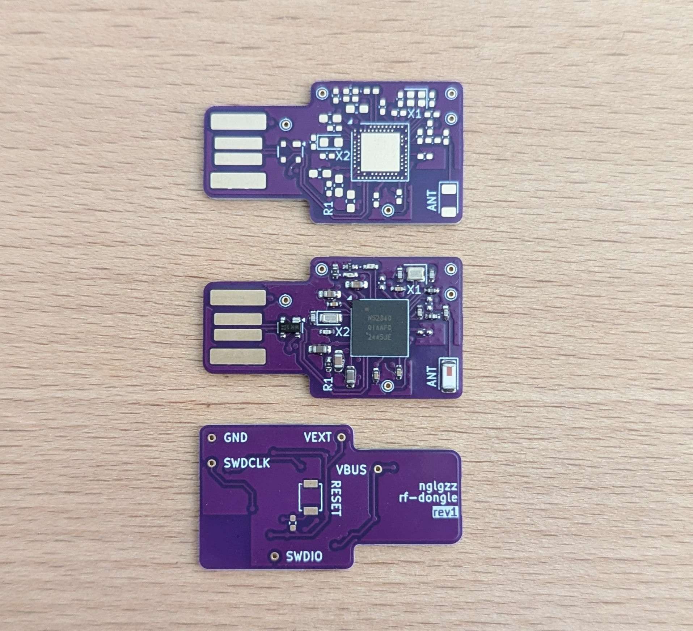
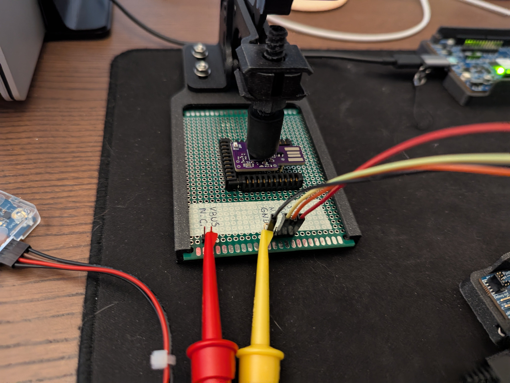

# RF Dongle

USB type-A dongle based on the nRF52840 microcontroller.

This dongle is meant to run the [COB firmware](https://github.com/nglgzz/cob_firmware),
though technically you can flash whatever you want on it.

> [!CAUTION]
>
> **Use at your own risk.**
>
> This PCB is not fully functional (i.e. USB GND pad is not
> connected and USB data lines aren't working).

## Current state

**What works**

- The dongle can be programmed through the SWD pads exposed on the back of the
  PCB.
- Debugging the microcontroller while it runs also works, through the same SWD
  pads.
- LEDs and reset buttons work.
- The chip antenna works and has a good range. I haven't tested its limit, but I
  tried both sending and receiving packets across a room (5-ish meters with a
  wall in between) and it worked fine and that's more than enough for my
  application.
- With the GND workaround mentioned below, USB power is working and the device
  gets detected by the host.

**What's broken**

- The USB GND pad is disconnected from the rest of the circuit (a workaround is
  to wire the pad to another GND pad in the vicinity).
- The USB enumeration is not working, I suspect something is wrong with the data
  lines but need to test more.

## Pics

This is the manufactured PCB (at [this commit](https://github.com/nglgzz/rf-dongle/tree/d430271ced6d7d4ebfe34358b9420bd28b8e23bf)).
The component pads are designed to make it easier to hand solder the components,
which is what I did.

 

Below is the test jig I'm using to program and debug the dongle. I hacked this
together with a perforated board, a few pogo pins, and battery connectors I had
lying around.

 

## Contributing

If you (unlike me) know what you're doing, and have tips for my circuit design,
please create an issue and tell me about it 🙏

## Learning

If you're curious about my learning journey with this project, I've documented
that [here](./LEARNING.md).
